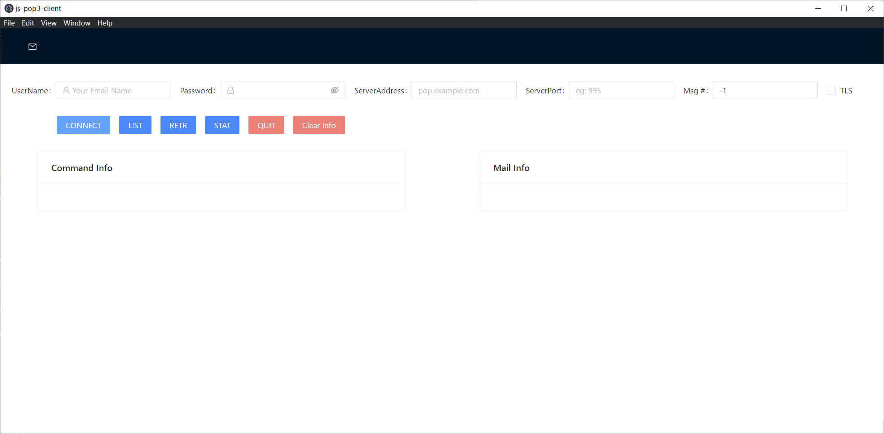

# js-pop3-client

js-pop3-client is a cross-paltform pop3 client. It's developed by electron-vue framework. We use a[nt-design-vue](https://antdv.com/docs/vue/introduce/) as UI library.



## Supported function

- `CONNECT`: `USER` and `PASS` command
- `LIST` command: show mail lists
- `STAT` command: show stat
- `RETR` command: show mail info
- `QUIT` command: disconnect

## Project setup: Install requirements

`node` Version: v16.13.0
`npm` Version: 8.1.0

Not tested on higher or lower version.

### How to install npm requirements

```
npm install
```

### Compiles and hot-reloads for development
```
npm run electron:serve
```

### Compiles and minifies for production
```
npm run electron:build
```
The command above will generate a installer.

### Lints and fixes files
```
npm run lint
```
